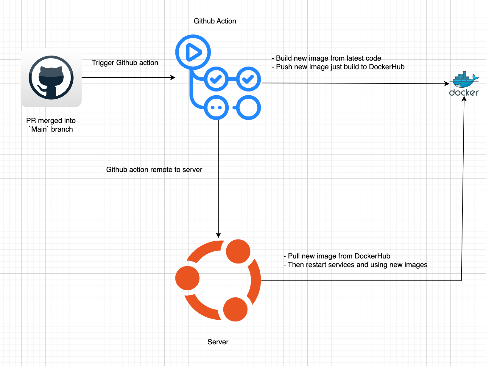

# Setting up the project with Docker

This guide will help you set up and run the project using Docker and Docker Compose.

## Requirements

Ensure that you have installed the following software on your machine:

- [Docker](https://www.docker.com/get-started)
- [Docker Compose](https://docs.docker.com/compose/install/)

## Getting Started

Follow these steps to set up and run the project:

### 1. Build and Run the Containers
Use Docker Compose to build and run the containers:

```sh
docker-compose up --build
```
This command will build the Docker images and start the containers defined in the `docker-compose.yml` file.

### 2. Access the Services
Once the containers are up and running, you can access the services:

- Django: http://localhost:8000

### 3. Stop the Containers
To stop the running containers, use the following command:

```sh
docker-compose stop
```

## Using Django with HTMX and Alpine.js
This project leverages HTMX and Alpine.js to enhance the interactivity and responsiveness of the web application.

## HTMX
HTMX allows you to perform AJAX requests directly from HTML attributes, making it easier to create dynamic web applications without writing a lot of JavaScript. For example, you can use `hx-get` to load content from the server:

```sh
<button hx-get="/some-url/" hx-target="#some-div">Load Content</button>
<div id="some-div"></div>
```

## Alpine.js
Alpine.js provides a lightweight framework for adding interactivity to your HTML. It is similar to Vue.js but much smaller and simpler. You can use Alpine.js to handle client-side behavior:

```sh
<div x-data="{ open: false }">
    <button @click="open = !open">Toggle</button>
    <div x-show="open">This is a toggleable content.</div>
</div>
```

## Installing Pre-commit Hooks

To maintain code quality and consistency, we use pre-commit hooks. Follow these steps to install and set up pre-commit hooks for this project:

1. Install `pre-commit`:

```sh
pip install pre-commit
```
2. Install the pre-commit hooks:
```sh
pre-commit install
```

## Deployment

### Dev environment

#### Steps:

1. After a PR is merged into `main`, a GitHub Action will be triggered.
2. The GitHub Action workflow will build a new image from the latest code.
3. After that, it will push the new image to DockerHub.
4. Then, it will connect to the server and pull the new image from DockerHub.
5. Finally, it will stop the service, clear the old image, and run the server with the new image.


Testing CD Deployment 🚀
vietthem lan 10